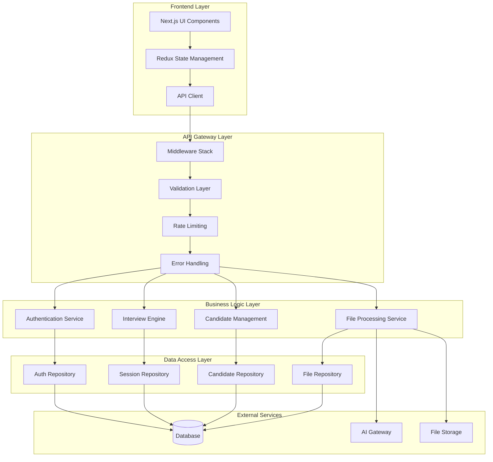

# Design Document

## Overview

The robust architecture design transforms the existing AI Interview Assistant into a highly maintainable, scalable, and error-resilient system. The design emphasizes clear separation of concerns, comprehensive error handling, and seamless data flow between frontend and backend components.

## Architecture

### High-Level Architecture



### Layered Architecture Principles

1. **Presentation Layer**: Next.js components with clear props interfaces
2. **State Management Layer**: Redux with normalized state and optimistic updates
3. **API Layer**: Standardized REST endpoints with consistent error handling
4. **Business Logic Layer**: Domain services with single responsibility
5. **Data Access Layer**: Repository pattern with transaction support
6. **Infrastructure Layer**: Database, file storage, and external service integrations

## Components and Interfaces

### 1. Enhanced API Gateway

```typescript
// lib/api/gateway.ts
interface ApiGateway {
  middleware: MiddlewareStack
  validation: ValidationLayer
  errorHandling: ErrorHandler
  rateLimit: RateLimiter
  cors: CorsHandler
}

interface MiddlewareStack {
  authenticate(req: Request): Promise<AuthContext>
  authorize(context: AuthContext, resource: string): Promise<boolean>
  validate(req: Request, schema: ZodSchema): Promise<ValidationResult>
  rateLimit(req: Request, key: string): Promise<RateLimitResult>
}
```

### 2. Standardized Error Handling

```typescript
// lib/errors/types.ts
interface ApiError {
  code: string
  message: string
  details?: Record<string, any>
  correlationId: string
  timestamp: string
}

interface ErrorHandler {
  handleValidationError(error: ZodError): ApiError
  handleDatabaseError(error: PrismaError): ApiError
  handleAuthError(error: AuthError): ApiError
  handleExternalServiceError(error: ExternalError): ApiError
}
```

### 3. Repository Pattern Implementation

```typescript
// lib/repositories/base.ts
interface BaseRepository<T> {
  create(data: CreateInput<T>): Promise<T>
  findById(id: string): Promise<T | null>
  findMany(filters: FilterInput<T>): Promise<PaginatedResult<T>>
  update(id: string, data: UpdateInput<T>): Promise<T>
  delete(id: string): Promise<void>
  transaction<R>(fn: (tx: Transaction) => Promise<R>): Promise<R>
}
```

### 4. State Management Architecture

```typescript
// store/types.ts
interface RootState {
  auth: AuthState
  candidates: CandidatesState
  sessions: SessionsState
  ui: UIState
  cache: CacheState
}

interface StateManager {
  optimisticUpdate<T>(action: OptimisticAction<T>): void
  revertOptimisticUpdate(actionId: string): void
  syncWithServer(): Promise<void>
  persistState(): Promise<void>
}
```

### 5. File Processing Service

```typescript
// lib/services/file-processing.ts
interface FileProcessingService {
  uploadFile(file: File): Promise<UploadResult>
  parseResume(fileId: string): Promise<ParseResult>
  analyzeWithAI(resumeText: string): Promise<AIAnalysisResult>
  validateFile(file: File): ValidationResult
  getProcessingStatus(fileId: string): Promise<ProcessingStatus>
}
```

## Data Models

### Enhanced Database Schema

```typescript
// Enhanced Prisma models with additional fields for robustness

model ProcessingJob {
  id          String   @id @default(cuid())
  type        String   // 'resume_parse', 'ai_analysis', etc.
  status      String   // 'pending', 'processing', 'completed', 'failed'
  input       Json
  output      Json?
  error       String?
  retryCount  Int      @default(0)
  maxRetries  Int      @default(3)
  createdAt   DateTime @default(now())
  updatedAt   DateTime @updatedAt
  completedAt DateTime?
}

model AuditLog {
  id          String   @id @default(cuid())
  userId      String?
  action      String
  resource    String
  resourceId  String?
  details     Json?
  ipAddress   String?
  userAgent   String?
  createdAt   DateTime @default(now())
}

model SystemHealth {
  id          String   @id @default(cuid())
  service     String
  status      String   // 'healthy', 'degraded', 'down'
  metrics     Json
  checkedAt   DateTime @default(now())
}
```

### State Normalization

```typescript
// Normalized state structure for efficient updates
interface NormalizedState {
  entities: {
    candidates: Record<string, Candidate>
    sessions: Record<string, InterviewSession>
    answers: Record<string, Answer>
    users: Record<string, User>
  }
  collections: {
    candidateIds: string[]
    sessionIds: string[]
    answerIds: string[]
  }
  ui: {
    loading: Record<string, boolean>
    errors: Record<string, ApiError>
    selectedIds: Record<string, string>
  }
}
```

## Error Handling

### Comprehensive Error Strategy

1. **API Level Errors**
   - Validation errors with field-specific messages
   - Authentication/authorization errors with clear actions
   - Rate limiting with retry-after headers
   - Server errors with correlation IDs

2. **Database Level Errors**
   - Connection failures with retry logic
   - Constraint violations with user-friendly messages
   - Transaction rollbacks with state recovery
   - Query timeouts with fallback strategies

3. **Frontend Error Boundaries**
   - Component-level error boundaries
   - Global error handling with user notifications
   - Offline state management
   - Retry mechanisms for failed requests

### Error Recovery Patterns

```typescript
// lib/resilience/patterns.ts
interface CircuitBreaker {
  execute<T>(fn: () => Promise<T>): Promise<T>
  getState(): 'closed' | 'open' | 'half-open'
  reset(): void
}

interface RetryPolicy {
  maxAttempts: number
  backoffStrategy: 'exponential' | 'linear' | 'fixed'
  retryableErrors: string[]
}

interface FallbackStrategy {
  execute<T>(primary: () => Promise<T>, fallback: () => Promise<T>): Promise<T>
}
```

## Testing Strategy

### Multi-Layer Testing Approach

1. **Unit Tests**
   - Repository layer tests with in-memory database
   - Service layer tests with mocked dependencies
   - Utility function tests with edge cases
   - Component tests with React Testing Library

2. **Integration Tests**
   - API endpoint tests with test database
   - Database migration tests
   - File processing pipeline tests
   - Authentication flow tests

3. **End-to-End Tests**
   - Complete user journey tests with Playwright
   - Cross-browser compatibility tests
   - Performance regression tests
   - Accessibility compliance tests

### Test Infrastructure

```typescript
// tests/setup/test-utils.ts
interface TestEnvironment {
  setupDatabase(): Promise<void>
  seedTestData(): Promise<void>
  cleanupDatabase(): Promise<void>
  mockExternalServices(): void
  createTestUser(role: UserRole): Promise<User>
}

interface TestHelpers {
  createCandidate(overrides?: Partial<Candidate>): Promise<Candidate>
  createSession(candidateId: string): Promise<InterviewSession>
  loginUser(user: User): Promise<AuthToken>
  uploadTestFile(type: FileType): Promise<UploadResult>
}
```

## Performance Optimizations

### Caching Strategy

1. **API Response Caching**
   - Redis-based caching for expensive operations
   - Cache invalidation on data mutations
   - Conditional requests with ETags

2. **Database Query Optimization**
   - Proper indexing on frequently queried fields
   - Query result caching for read-heavy operations
   - Connection pooling for concurrent requests

3. **Frontend Performance**
   - Component memoization with React.memo
   - Virtual scrolling for large lists
   - Code splitting with dynamic imports
   - Image optimization with Next.js

### Monitoring and Observability

```typescript
// lib/monitoring/metrics.ts
interface MetricsCollector {
  recordApiRequest(endpoint: string, duration: number, status: number): void
  recordDatabaseQuery(query: string, duration: number): void
  recordFileProcessing(type: string, size: number, duration: number): void
  recordUserAction(action: string, userId: string): void
}

interface HealthChecker {
  checkDatabase(): Promise<HealthStatus>
  checkExternalServices(): Promise<HealthStatus>
  checkFileStorage(): Promise<HealthStatus>
  getSystemMetrics(): Promise<SystemMetrics>
}
```

## Security Enhancements

### Authentication & Authorization

1. **JWT Token Management**
   - Secure token storage with httpOnly cookies
   - Token refresh mechanism
   - Role-based access control

2. **Input Validation**
   - Comprehensive Zod schemas for all inputs
   - File upload validation and sanitization
   - SQL injection prevention with Prisma

3. **Security Headers**
   - CORS configuration
   - CSP headers for XSS protection
   - Rate limiting per user/IP

## Migration Strategy

### Incremental Implementation

1. **Phase 1: Core Infrastructure**
   - Enhanced error handling
   - Repository pattern implementation
   - Improved state management

2. **Phase 2: Robustness Features**
   - Comprehensive testing
   - Monitoring and logging
   - Performance optimizations

3. **Phase 3: Advanced Features**
   - Real-time capabilities
   - Advanced caching
   - Scalability improvements

### Backward Compatibility

- Maintain existing API contracts during migration
- Gradual component replacement strategy
- Feature flags for new functionality
- Database migration scripts with rollback support