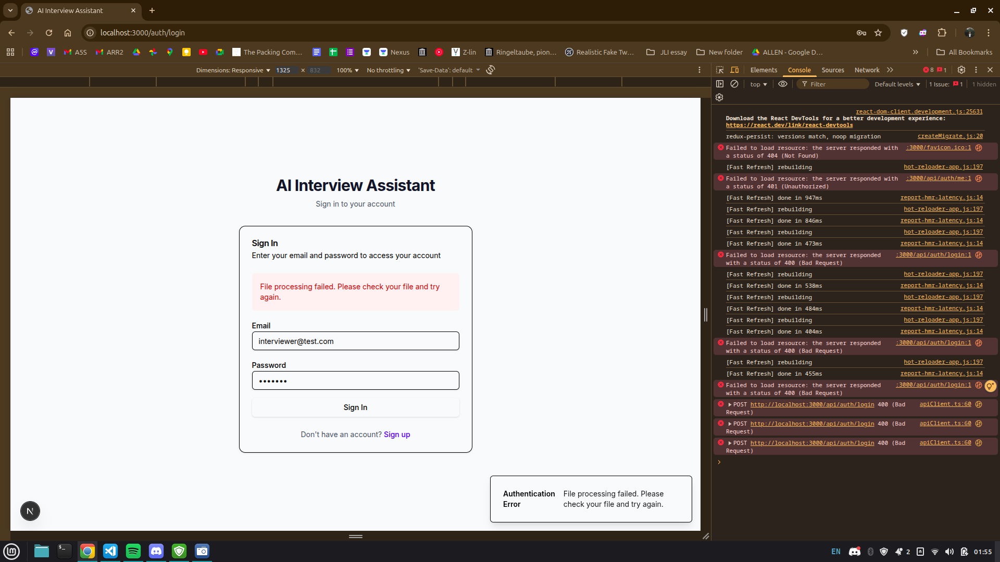

# Implementation Plan

- [x] 1. Establish core infrastructure and error handling foundation
  - Create standardized error types and handling utilities
  - Implement correlation ID system for request tracing
  - Set up comprehensive logging infrastructure
  - _Requirements: 1.1, 1.4, 6.1, 6.2_

- [x] 1.1 Create standardized error handling system
  - Implement ApiError interface and error type definitions
  - Create error handler utilities for different error categories
  - Add correlation ID generation and tracking
  - _Requirements: 1.1, 6.1_

- [x] 1.2 Implement comprehensive logging infrastructure
  - Set up structured logging with correlation IDs
  - Create logging utilities for API requests, database operations, and user actions
  - Add log levels and filtering capabilities
  - _Requirements: 6.1, 6.2, 6.3_

- [x] 1.3 Enhance API middleware stack
  - Create authentication middleware with proper error handling
  - Implement request validation middleware using existing Zod schemas
  - Add rate limiting middleware with configurable limits
  - _Requirements: 1.2, 8.2_

- [x] 2. Implement repository pattern and database layer improvements
  - Create base repository interface and implementation
  - Refactor existing repositories to use consistent patterns
  - Add transaction support and connection pooling
  - _Requirements: 2.3, 1.3, 8.4_

- [x] 2.1 Create base repository pattern
  - Implement BaseRepository interface with CRUD operations
  - Add transaction support for multi-step operations
  - Create repository factory for dependency injection
  - _Requirements: 2.3, 1.3_

- [x] 2.2 Refactor existing repositories
  - Update candidatesRepo to extend BaseRepository
  - Update sessionsRepo to extend BaseRepository
  - Update authRepo to extend BaseRepository
  - _Requirements: 2.3, 1.3_

- [x] 2.3 Add database monitoring and health checks
  - Implement database connection health monitoring
  - Add query performance logging
  - Create database metrics collection
  - _Requirements: 6.2, 6.5_

- [x] 2.4 Write repository unit tests
  - Create unit tests for BaseRepository operations
  - Test transaction rollback scenarios
  - Test error handling in repository methods
  - _Requirements: 7.4_

- [-] 3. Enhance state management and frontend architecture
  - Implement normalized state structure
  - Add optimistic updates with rollback capability
  - Create consistent API client with error handling
  - _Requirements: 3.1, 3.3, 2.4_

- [x] 3.1 Implement normalized Redux state structure
  - Refactor existing Redux slices to use normalized entities
  - Create selectors for efficient data access
  - Add state persistence with error recovery
  - _Requirements: 3.1, 5.3_

- [x] 3.2 Create robust API client
  - Implement API client with automatic retry logic
  - Add request/response interceptors for error handling
  - Create optimistic update mechanisms
  - _Requirements: 3.1, 3.2, 1.4_

- [x] 3.3 Enhance UI components with error boundaries
  - Create error boundary components for graceful error handling
  - Add loading states and error displays to existing components
  - Implement offline state management
  - _Requirements: 3.3, 5.2_

- [x] 3.4 Write frontend component tests
  - Create tests for error boundary components
  - Test optimistic update scenarios
  - Test offline state handling
  - _Requirements: 7.3_

- [ ] 4. Implement robust file processing service
  - Create file processing service with retry mechanisms
  - Add file validation and sanitization
  - Implement processing status tracking
  - _Requirements: 4.1, 4.2, 4.3, 4.4_

- [x] 4.1 Create file processing service architecture
  - Implement FileProcessingService interface
  - Add support for multiple file formats with fallback parsing
  - Create file validation utilities
  - _Requirements: 4.1, 4.5_

- [x] 4.2 Add processing job queue and status tracking
  - Create ProcessingJob model for tracking file operations
  - Implement retry mechanisms for failed processing
  - Add progress tracking for large file uploads
  - _Requirements: 4.2, 4.3, 4.4_

- [x] 4.3 Enhance AI integration with error handling
  - Add circuit breaker pattern for AI service calls
  - Implement fallback strategies for AI service failures
  - Add request/response validation for AI operations
  - _Requirements: 1.4, 4.2_

- [x] 4.4 Write file processing tests
  - Create tests for file validation and parsing
  - Test retry mechanisms and error scenarios
  - Test AI integration with mocked responses
  - _Requirements: 7.2_

- [x] 5. Add monitoring, health checks, and observability
  - Implement health check endpoints
  - Create metrics collection system
  - Add system monitoring dashboard
  - _Requirements: 6.4, 6.5, 8.1_

- [x] 5.1 Create health check system
  - Implement health check endpoints for all services
  - Add database connectivity checks
  - Create external service health monitoring
  - _Requirements: 6.5_

- [x] 5.2 Implement metrics collection
  - Create MetricsCollector for API, database, and user metrics
  - Add performance monitoring for critical operations
  - Implement system resource monitoring
  - _Requirements: 6.4, 8.1_

- [x] 5.3 Add audit logging system
  - Create AuditLog model for tracking user actions
  - Implement audit logging middleware
  - Add audit trail for sensitive operations
  - _Requirements: 6.3_

- [x] 6. Implement caching and performance optimizations
  - Add response caching for expensive operations
  - Implement database query optimization
  - Create frontend performance enhancements
  - _Requirements: 8.1, 8.3, 5.1_

- [x] 6.1 Implement API response caching
  - Add caching layer for candidate listings and session data
  - Implement cache invalidation on data mutations
  - Create cache warming strategies for frequently accessed data
  - _Requirements: 8.1_

- [x] 6.2 Optimize database queries and indexing
  - Add proper indexes for frequently queried fields
  - Optimize existing queries for better performance
  - Implement query result caching where appropriate
  - _Requirements: 8.3_

- [x] 6.3 Enhance frontend performance
  - Add React.memo to expensive components
  - Implement virtual scrolling for candidate lists
  - Add code splitting for route-based chunks
  - _Requirements: 5.1_

- [x] 7. Implement comprehensive testing suite
  - Create test utilities and helpers
  - Add integration tests for API endpoints
  - Implement end-to-end test scenarios
  - _Requirements: 7.1, 7.2, 7.5_

- [x] 7.1 Create test infrastructure and utilities
  - Set up test database with seeding utilities
  - Create test helpers for common operations
  - Implement mock factories for test data
  - _Requirements: 7.1, 7.4_

- [x] 7.2 Add API integration tests
  - Create integration tests for all API endpoints
  - Test authentication and authorization flows
  - Test error scenarios and edge cases
  - _Requirements: 7.2_

- [x] 7.3 Implement end-to-end test scenarios
  - Create E2E tests for complete user journeys
  - Test interviewer and interviewee workflows
  - Add cross-browser compatibility tests
  - _Requirements: 7.5_

- [x] 7.4 Add performance and load testing
  - Create performance benchmarks for critical operations
  - Implement load testing for concurrent users
  - Add memory leak detection tests
  - _Requirements: 8.4_

- [x] 8. Enhance security and authentication
  - Implement secure token management
  - Add comprehensive input validation
  - Create security headers and CORS configuration
  - _Requirements: 1.5, 2.2, 8.2_

- [x] 8.1 Enhance authentication system
  - Implement secure JWT token management with refresh
  - Add role-based access control validation
  - Create session management with proper cleanup
  - _Requirements: 1.5_

- [x] 8.2 Implement comprehensive input validation
  - Enhance existing Zod schemas with security validations
  - Add file upload validation and sanitization
  - Implement request size limits and timeouts
  - _Requirements: 2.2_

- [x] 8.3 Add security headers and protection
  - Configure CORS policies for production
  - Add CSP headers for XSS protection
  - Implement rate limiting per user and IP
  - _Requirements: 8.2_

- [ ] 9. Create migration utilities and deployment preparation
  - Implement database migration scripts
  - Create deployment configuration
  - Add environment-specific configurations
  - _Requirements: 1.3, 8.5_

- [ ] 9.1 Create database migration utilities
  - Implement migration scripts for new schema additions
  - Add rollback capabilities for failed migrations
  - Create data seeding scripts for different environments
  - _Requirements: 1.3_

- [ ] 9.2 Prepare production deployment configuration
  - Configure environment variables for different stages
  - Set up Docker configuration for containerized deployment
  - Create CI/CD pipeline configuration
  - _Requirements: 8.5_

- [ ] 9.3 Add configuration management
  - Implement environment-specific configuration loading
  - Add feature flags for gradual rollout
  - Create configuration validation utilities
  - _Requirements: 8.5_